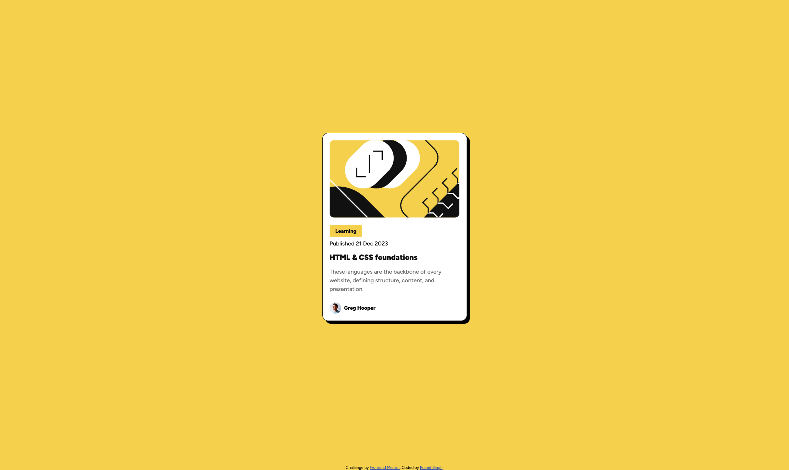

# Frontend Mentor - Blog preview card solution

This is my solution to the [Blog preview card challenge on Frontend Mentor](https://www.frontendmentor.io/challenges/blog-preview-card-ckPaj01IcS). The project recreates a blog preview card using HTML and CSS, with an article illustration, category label, publication date, title, description, and author details.

## Table of contents

- [Overview](#overview)
  - [The challenge](#the-challenge)
  - [Screenshots](#screenshots)
  - [Links](#links)
- [My process](#my-process)
  - [Built with](#built-with)
  - [What I learned](#what-i-learned)
  - [Continued development](#continued-development)
  - [AI Collaboration](#ai-collaboration)
- [Author](#author)
- [Acknowledgments](#acknowledgments)

## Overview

### The challenge

Build a blog preview card that looks as close as possible to the supplied desktop and mobile designs.

The challenge also asks that users can see hover and focus states for interactive elements on the page.

### Screenshots

**Desktop**

**Mobile**

### Links

- Source code: [GitHub repository](https://github.com/pramitsingh0/blog-preview-fe)
- Live site: [Blog preview card](https://pramitsingh.github.io/blog-preview-fe/)

## My process

### Built with

- HTML5, including `main`, `h1`, and `footer` elements
- CSS Flexbox
- Relative units such as `rem` and percentages
- CSS borders, rounded corners, and box shadows
- Figtree font from Google Fonts

### What I learned

This project provided practice with the following HTML and CSS concepts:

- **Arranging content with Flexbox:** The card uses `flex-direction: column` to stack its sections vertically. The author section uses a row with `align-items: center` to align the avatar and name.
- **Understanding spacing and the box model:** Padding creates space inside the card, while margins add space outside elements. The `gap` property controls spacing between flex items. Using `box-sizing: border-box` includes padding and borders in an element's specified width.
- **Sizing images:** The article image uses `width: 100%` and `height: auto` to fit its container while keeping its proportions. The avatar uses a fixed square container and `object-fit: cover` to fill that space.
- **Recreating the card's appearance:** A border, rounded corners, and a solid offset `box-shadow` create the outlined card effect. Font sizes, weights, and line height establish a clear visual hierarchy between the title, description, and supporting details.
- **Organizing HTML and CSS:** Descriptive classes such as `card__content` and `card__author` make it easier to connect each part of the HTML to its styles. A `main` element identifies the main content, and an `h1` marks the page's primary heading.

### Continued development

Areas for further practice include:

- Refining the card's width and outer spacing across smaller screens.
- Adding and checking clear hover and keyboard focus styles for links.
- Using CSS custom properties to keep repeated colors and spacing values in one place.
- Reviewing image descriptions and keyboard navigation to make the page easier to use.

### AI Collaboration

I used an AI assistant to help adapt the provided README template, add screenshot and project links, and draft explanations of the HTML and CSS concepts used in the project.

## Author

- Name: Pramit Singh
- Website: [pramitsingh.netlify.app](https://pramitsingh.netlify.app)
- GitHub: [@pramitsingh0](https://github.com/pramitsingh0)

## Acknowledgments

Thanks to Frontend Mentor for providing the challenge, designs, and assets.
